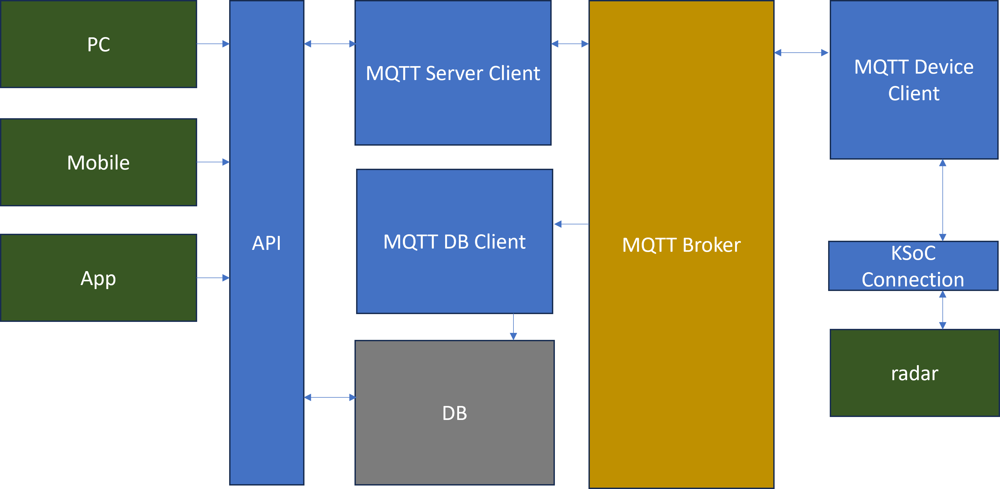

# Radar_IoT

此專案為使用Radar技術進行物聯網應用的研究專案，主要目的為透過Radar技術進行物體偵測，並透過物體偵測的結果進行物聯網應用的研究。

主要使用傳輸協定MQTT，並透過MQTT進行物聯網應用的開發。

希望做到的功能:
1. 透過Radar技術進行物體偵測，並透過MQTT傳輸至Server端儲存時序資料到資料庫紀錄數據。

2. 建立API讓用戶透過API來對遠端Radar裝置進行操作，並在API內管理使用者對遠端設備的使用權限。

3. API透過MQTT進行物聯網應用的開發，並透過MQTT進行遠端裝置的控制。

## 使用技術
- 硬體裝置的potorcal 與 serial port 通訊

- MQTT 通訊協定

- pyhton

- FastAPI

- SQLite


## 安裝與環境
- 建議使用Python 3.8以上版本，本專案使用Python 3.11.6版本進行開發。

- 硬體環境請使用 windows 10 以上版本，並安裝相關的驅動程式。因為本專案使用的Radar裝置使用windows API實作serial port 在底層進行資料的傳輸。

- 專案使用poetry進行管理，請先安裝poetry套件，步驟如下。

    1. virtualenv 建立虛擬環境
    2. 使用poetry指令在 shell 中使用虛擬環境
    ```shell
    poetry shell
    ```
    3. 安裝專案所需套件
    ```shell
    poetry install
    ```

## 架構



### 裝置端:
- 硬體: Radar裝置
- 軟體: 
    1. `KSoC Connection`: 透過Serial port 與硬體進行溝通和資料的傳輸

    2. `MQTT Device Client`: 透過MQTT協定與Server端進行溝通和資料的傳輸

### Server端:
- 軟體:
    1. `MQTT Server Client`: publish user 端的指令到裝置並根據topic對裝置進行控制。

    2. `MQTT DB Client`: 收取subscribe的時序監控資料並存入資料庫

    3. `API`: 提供使用者透過API進行裝置的控制和監控，讀取資料庫的資料並提供給使用者並進行權限的管理。

    4. `DB`: 存放時序資料的資料庫，以及使用者的資料，裝置資料，MQTT topic等。

### user端:
- 裝置: PC or 手機

## 目前遇到的問題
